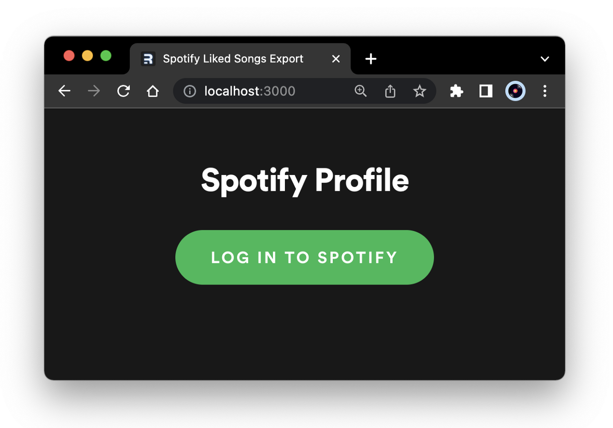
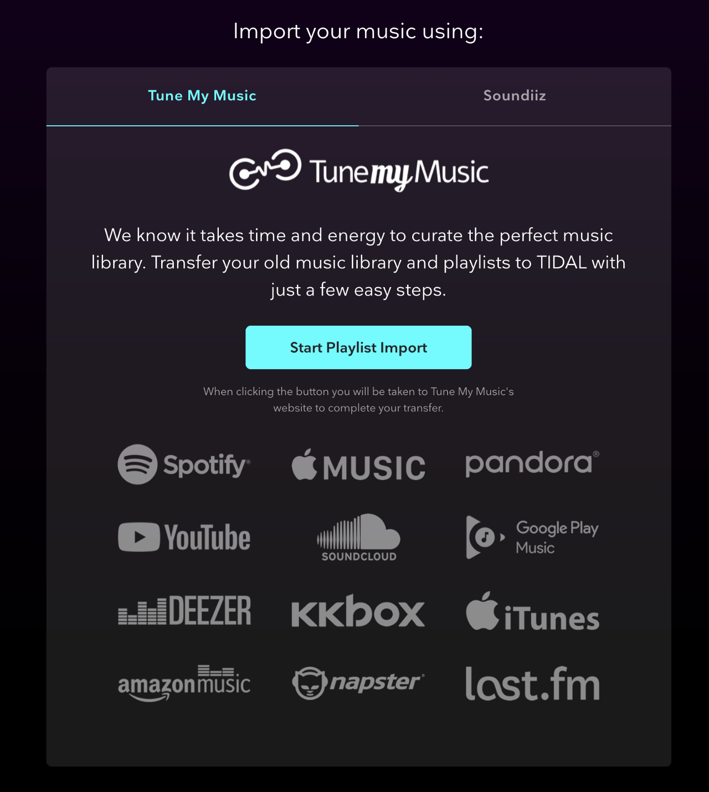
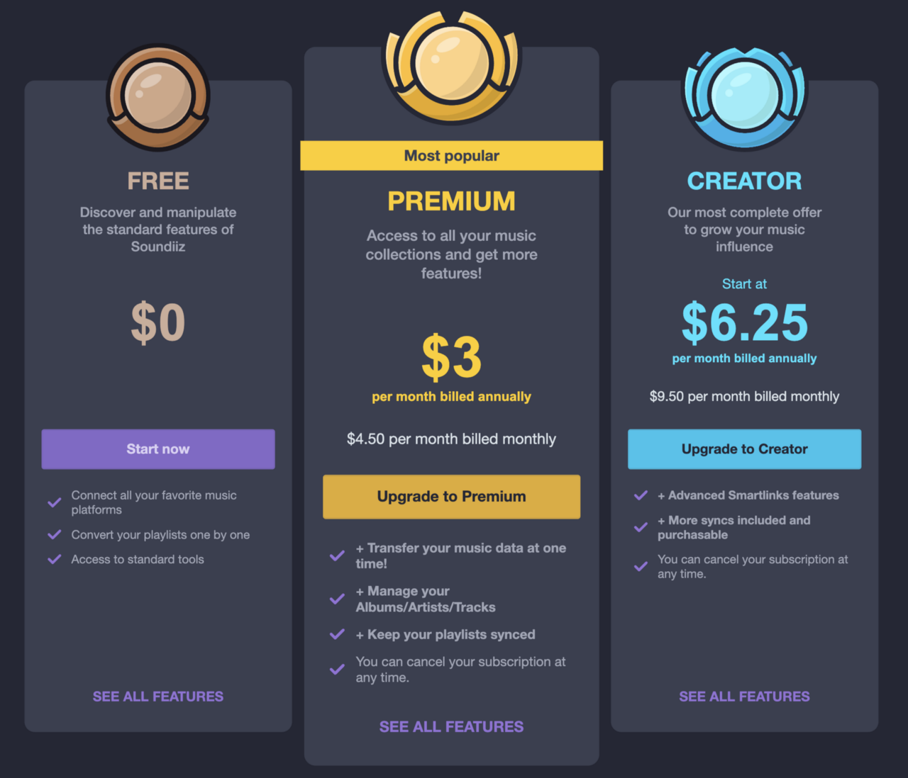
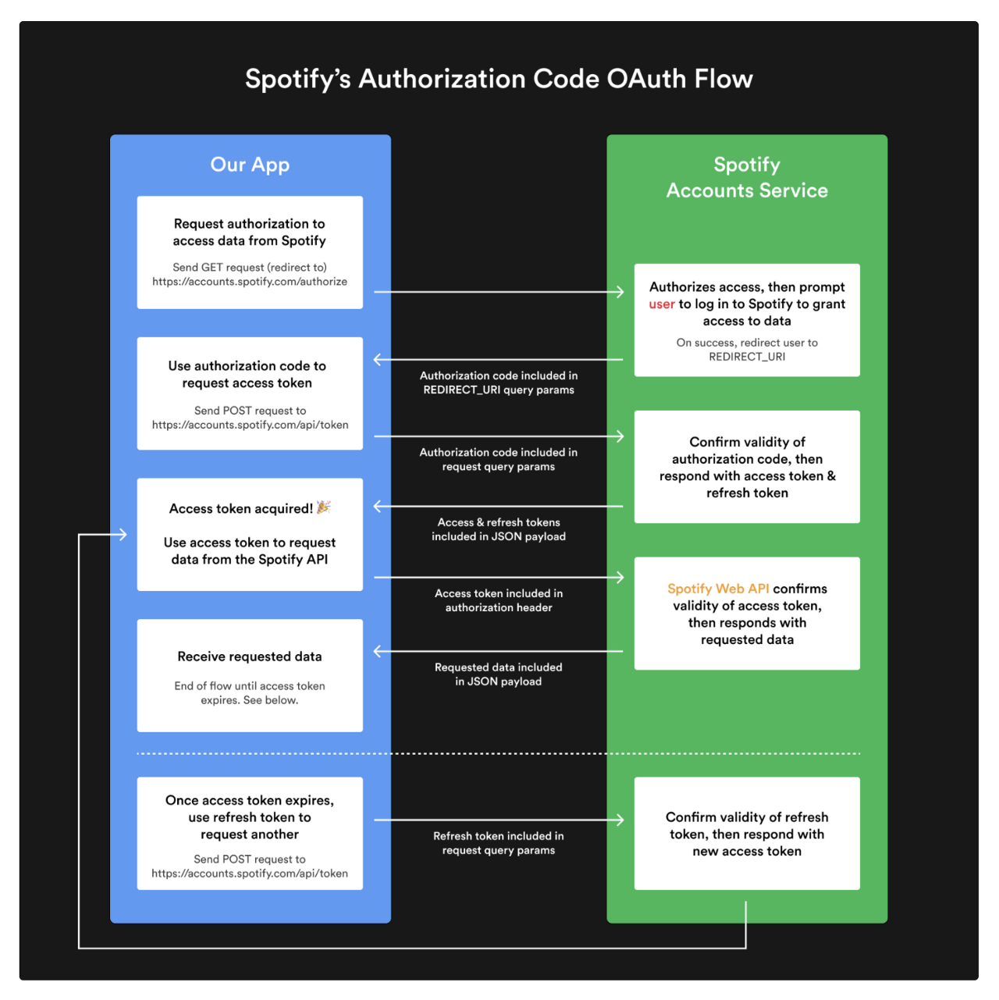

<p align="center">
    
</p>

## Spotify Liked Songs Export
#### A Spotify Authorization Code flow using Remix and paginated GraphQL queries using StepZen.


<br/>

<p align="center">
  
  
  
</p>

- **[How Portable Is Spotify?](overview.md): Exporting My Saved Music**


  > I was disappointed to discover, when I tried to migrate my playlists to Tidal, that the free versions of both recommended transfer apps have 250-song restrictions–and the paid versions are subscription apps. Given a choice, I'd rather not enroll in a monthly subscription to a (likely) single-use app.


<br/>

<p align="center">
  
</p>

<br/>

- **[A Spotify OAuth flow in Remix](authflow.md): Using CookieSessionStorage**


  > Where @materializer allows us to step through our API requests in implicit order, simply by descending through our type fields and back-filling secondary data, @sequence lets us step through API requests in explicit order. 


```graphql
type Query {
  get_saved_tracks(
    access_token: String!
    first: Int! = 50
    after: String! = ""
  ): TrackConnection
    @rest(
      endpoint: "https://api.spotify.com/v1/me/tracks?limit=$first&offset=$after"
      headers: [{
        name: "Authorization",
        value: "Bearer $access_token"
      }]
      resultroot: "items[]"
      pagination: {
        type: OFFSET
        setters: [{field:"total", path: "total"}]
      }
      setters: [
        { field: "track_id", path: "track.id" }
        { field: "track_name", path: "track.name" }
        { field: "artist_id", path: "track.artists[].id" }
        { field: "artist_name", path: "track.artists[].name" }
        { field: "popularity", path: "track.popularity" }
        { field: "preview_url", path: "track.preview_url" }
        { field: "isrc", path: "track.external_ids.isrc" }
      ]
    )
}
```


- **[Designing a Spotify GraphQL schema with StepZen](stepzen.md): Paginating results**


  > Where @materializer allows us to step through our API requests in implicit order, simply by descending through our type fields and back-filling secondary data, @sequence lets us step through API requests in explicit order. 


<br/>

<p align="center">
  
</p>

<br/>

- **[Build A Spotify Connected App](https://www.newline.co/courses/build-a-spotify-connected-app): Learn how to build a full stack web app to visualize personalized Spotify data with the help of Node.js, React, Styled Components, and the Spotify Web API.**


  > Credit mainly to Brittany Chiang, whose recent newline.co course Build a Spotify Connect App (free online at the moment) is a concise masterclass in best practices for REST API client-building. (And whose code and architecture I'll be replicating as much as possible.)
  >
  > The two main modifications we'll be making to Brittany's code will be 1. adapting the OAuth flow to use Remix's routing and 2. orchestrating the multiple API calls for user info with StepZen rather than Axios (and focusing our query on Liked Songs.)

<br/>