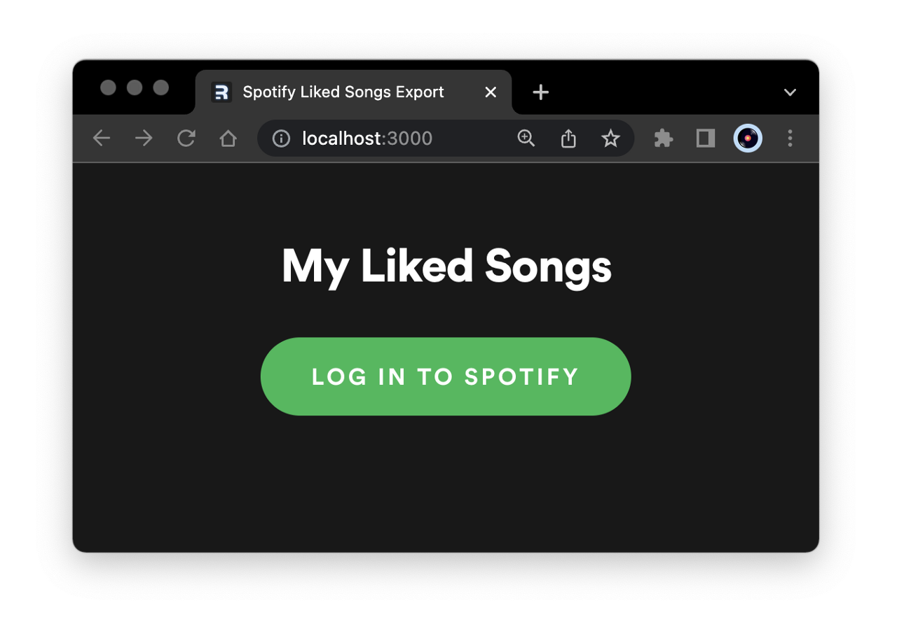

## Spotify Liked Songs Export
#### Spotify OAuth flow using Remix and GraphQL-as-a-service using StepZen.

    

- **[How Portable Is Spotify?](overview.md): Exporting My Saved Music**

  > I was disappointed to discover, when I tried to migrate my playlists to Tidal, that the free versions of both recommended transfer apps have 250-song restrictions (and the paid versions are subscription apps!)

 

  
  
  

- **[A Spotify OAuth flow in Remix](authflow.md): Using CookieSessionStorage**

  > In the Loader for my <code>/callback</code>, I grab the <code>code</code> from the url and query an access token using the Fetch API. That token is immediately extracted, set as a Cookie using <code>getSession</code>, and persisted server-side using <code>commitSession</code>.

  

  

- **[Designing a Spotify GraphQL schema with StepZen](stepzen.md): Paginating results**

  > This proves immediately useful in the loader for our <code>/tracks</code> route, which uses a <code>while</code> statement to keep track of the returned <code>hasNextPage</code> boolean, until the request is fully depaginated.

 

  

 

- **[Build A Spotify Connected App](https://www.newline.co/courses/build-a-spotify-connected-app): Learn how to build a full stack web app to visualize personalized Spotify data with the help of Node.js, React, Styled Components, and the Spotify Web API.**

  > Credit mainly to Brittany Chiang, whose recent newline.co course Build a Spotify Connect App (free online at the moment) is a concise masterclass in best practices for REST API client-building. (And whose code and architecture I used as a starting point.)

 