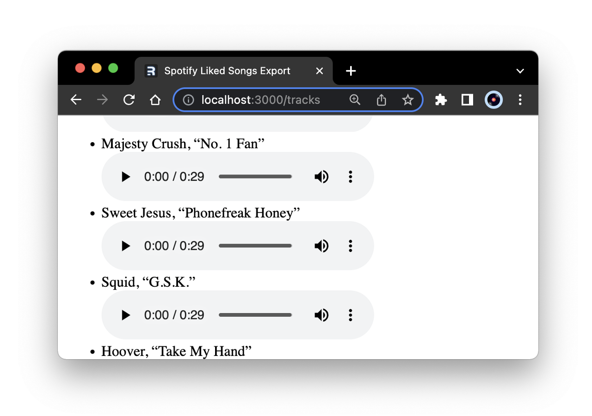

**Designing a Spotify GraphQL schema with StepZen: Depaginating results**

Spotify returns an insane amount of basic track data, so it's useful to heavily pare it down ASAP, fir which transforming it to a compact GraphQL type using StepZen is a life-saver.

The most important data point from a data portability perspective is the ISRC: an International Standard Recording Code, which we can use to interface with Amazon Music, Apple Music, or any of the streaming services.

```graphql
type Track {
  added_at: String
  track_id: String
  track_name: String
  artist_id: String
  artist_name: String
  popularity: Int
  preview_url: String
  isrc: String
}

type TrackEdge {
  node: Track
  cursor: String
}

type TrackConnection {
  pageInfo: PageInfo!
  edges: [TrackEdge]
}

type Query {
  get_saved_tracks(
    access_token: String!
    first: Int! = 50
    after: String! = ""
  ): TrackConnection
    @rest(
      endpoint: "https://api.spotify.com/v1/me/tracks?limit=$first&offset=$after"
      headers: [{
        name: "Authorization",
        value: "Bearer $access_token"
      }]
      resultroot: "items[]"
      pagination: {
        type: OFFSET
        setters: [{field:"total", path: "total"}]
      }
      setters: [
        { field: "track_id", path: "track.id" }
        { field: "track_name", path: "track.name" }
        { field: "artist_id", path: "track.artists[].id" }
        { field: "artist_name", path: "track.artists[].name" }
        { field: "popularity", path: "track.popularity" }
        { field: "preview_url", path: "track.preview_url" }
        { field: "isrc", path: "track.external_ids.isrc" }
      ]
    )
}
```

StepZen implements the <a href="https://graphql.org/learn/pagination/">GraphQL pagination spec</a>, so by setting options as above (notice the required <code>TrackEdge</code> and <code>TrackConnection</code> types) we can hit our StepZen GraphQL endpoint using standard cursor syntax.


```js
// remix > app > routes > tracks.tsx

export async function getTracks(token: String, cursor: String = '') {
  let res = await fetch(`${process.env.STEPZEN_ENDPOINT}`, {
    method: "POST",
    headers: {
      "Content-Type": "application/json",
      "Authorization": `${process.env.STEPZEN_API_KEY}`
    },
    body: JSON.stringify({
      query: `
        query MyQuery($access_token: String!, $after: String!) {
          get_saved_tracks(access_token: $access_token, after: $after) {
            edges {
              node {
                added_at
                artist_id
                artist_name
                isrc
                popularity
                preview_url
                track_id
                track_name
              }
              cursor
            }
            pageInfo {
              endCursor
              hasNextPage
              hasPreviousPage
              startCursor
            }
          }
      }`,
      variables: {
        access_token: token,
        after: cursor
      },
    }),
  })
  let data = await res.json();
  // console.log('data in function: ', data);
  let tracks = data.data.get_saved_tracks;
  // console.log('tracks in function', tracks);
  return tracks;
}
```


This proves immediately useful in the loader for our <code>/tracks</code> route, which uses a <code>while</code> statement to keep track of the returned <code>hasNextPage</code> boolean, until the request is fully depaginated.

```js
// remix > app > routes > tracks.tsx

export const loader: LoaderFunction = async ({ 
  request 
}) => {
  const session = await getSession(
    request.headers.get("Cookie")
    );
  const token = session.get("token") || null;
  // console.log('token: ', token)
  let tracks = await getTracks(token);
  // console.log('tracks in loader: ', tracks);
  let edges = tracks.edges;
  // console.log('edges in loader: ', edges.length);
  let endCursor = tracks.pageInfo.endCursor;
  // console.log('endCursor in loader: ', endCursor);
  let hasNextPage = tracks.pageInfo.hasNextPage;
  while (hasNextPage){
    // console.log('endCursor: ', endCursor);
    let moreTracks = await getTracks(token, endCursor)
    let moreEdges = moreTracks.edges;
    // console.log('moreEdges in loader: ', moreEdges.length);
    Array.prototype.push.apply(edges, moreEdges);
    console.log('edges after push ', edges.length);
    let moreNext = moreTracks.pageInfo.hasNextPage;
    // console.log('moreEdges in loader: ', moreEdges.length);
    let moreCursor = moreTracks.pageInfo.endCursor;
    // console.log('moreCursor in loader: ', moreCursor)
    endCursor = moreCursor;
    hasNextPage = moreNext;
    ;
  }
  return edges;
}

```

Mass presentable on first load (if not yet design-presentable) and suitable for cross-API transferability.

```js
// remix > app > routes > tracks.tsx

export default function Tracks() {
  const edges = useLoaderData();
  // console.log(edges)
  const tracks = edges?.map((track, i) =>
    <li key={i}>
      {track.node.artist_name}, “{track.node.track_name}”
       <br></br>
       <audio 
          controls
          src={track.node.preview_url}>
       </audio>
    </li>
  );
  
  return (
    <ul>
      {tracks}
    </ul>
  )
}
```

<br/>

<p align="center">
    
</p>